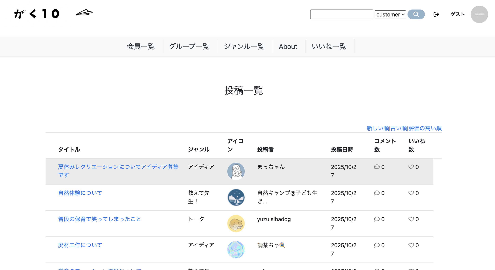
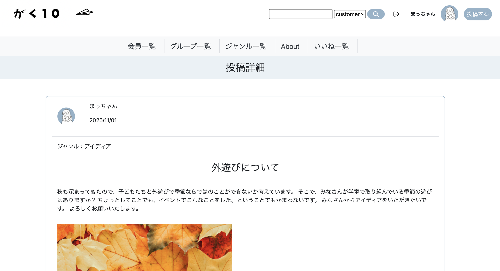
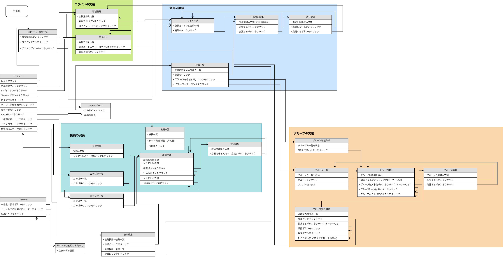
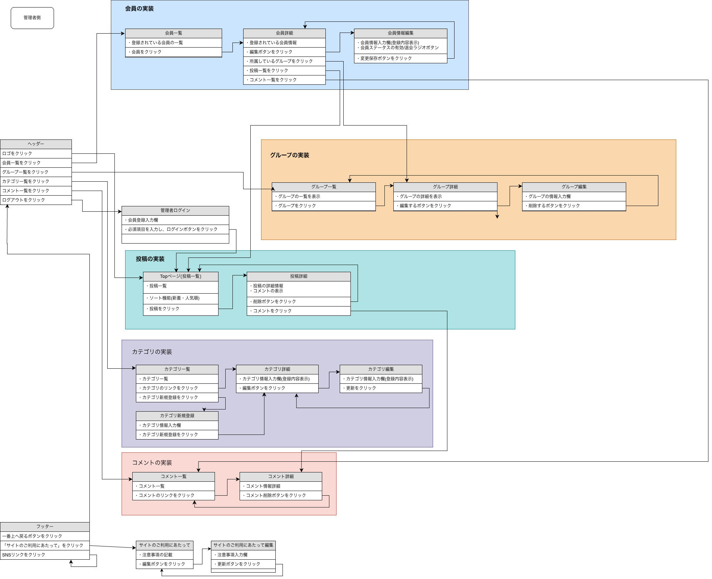
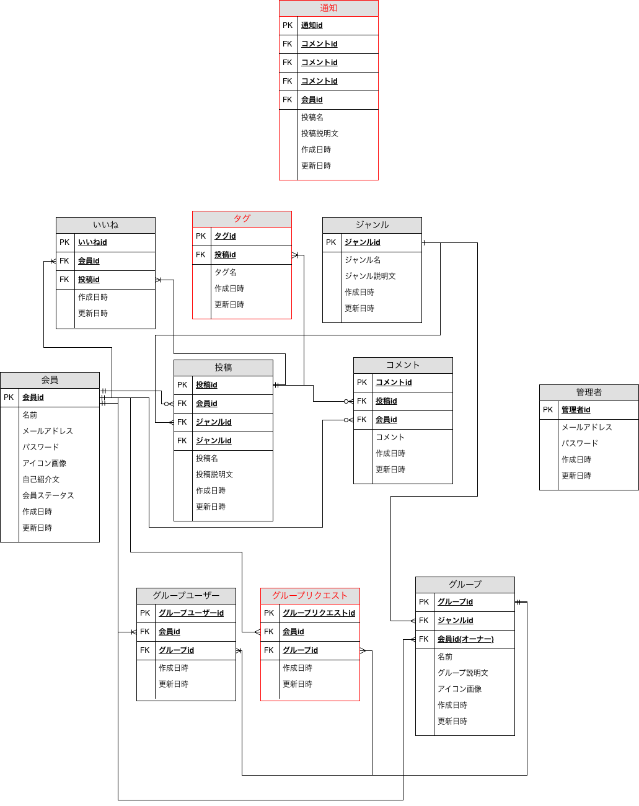

# 　がく10
<!--​READMEを作成する際は、項目内の【補足説明】は削除して完成させてください。-->
## サイト概要
学童の先生同士で交流できるコミュニティサイト

## URL
本番環境：http://13.159.207.183/

## デモログイン
一般ユーザー:  
Email: mattchan@example.com  
Password: macchan  

管理ユーザー（/admin）  
Email: 123@456  
Password: 123456
管理画面URL：[http://admin/sign_in](http://13.159.207.183/admin/sign_in)

## 画面イメージ

  
  
  

### サイトテーマ
・コミュニティサイト
・「学童の先生同士で交流できるサイト」
<!-- 【補足説明】 -->
<!-- - 〜なコミュニティサイトorレビューサイトorSNS　と１文で記載する -->
​
### テーマを選んだ理由
　私は前職で学童支援員をしていました。  
　日々の保育のなかで問題にあたったときに、他の学童はどうしているんだろう？ 
　と気になったり、家に帰ってからずっと子どもへの悩みが頭から離れない日も少なくありませんでした。 
　そんなときに問題を共有できたり、宿題の教え方や遊びなど、色々なアイディアや情報を 
　交換できる場があればいいと思ったことがきっかけでした。 
　また、学童についてよく知らない方にも知ってもらえるようなサイトが良いと思いました。 
　ネットで探してみたのですが、学校の先生や保育園の先生のサイトはありましたが、 
　学童の先生に関するコミュニティサイトは見つけられなかったので、作成してみようと考えました。
<!-- 【補足説明】 -->
<!-- - ですます調で記載しましょう。READMEファイルは企業様も見られます。 -->
<!-- - ３文以上記載しましょう。 -->

<!--　★テーマ理由を記載する際のポイント　-->
<!-- - 自分自身の背景の説明（このポートフォリオを作る前提を説明） -->
<!-- - 扱う題材が抱えている問題・課題の説明 -->
<!-- - ターゲットとするユーザーが持つであろう課題の説明（需要をアピールするため） -->
<!-- - 当問題を解決するために、このようなポートフォリオを制作してみようと考えました」という結び -->

<!-- ★記載例 -->
<!-- もともと料理が好きで、オリジナルレシピで料理を作ることが多いのですが、少しずつレシピが1パターンになってきており頭を悩ませていました。 -->
<!-- 身近に自分と同じように、料理を好んでする友人がいないため困っていた所、他の人がどのようなレシピで作っているのかを知れるサービスがあれば便利だと考えました。 -->
<!-- また料理好きな人だけでなく、日々料理を作る必要があるがレシピに困っている人の助けにもなると考え、このテーマにしました。 -->
​
### ターゲットユーザ
・まわりになかなか相談できない学童の先生
・支援のアイディアがほしい学童の先生
<!-- 【補足説明】 -->
<!-- - 〜な人という記載方法で、2つ以上記載しましょう -->
<!-- - テーマ理由と矛盾のないターゲットを選出しましょう -->
<!-- - 実際にサービスを利用する立場であると想定しましょう  -->
​
### 主な利用シーン
・遊びやレクリエーションのアイディアを知りたい時 
・他の先生の意見や感想を知りたい時 
・さまざまな困りごとにどのように対処すればいいか知りたい時
<!-- 【補足説明】 -->
<!-- - 〜な時という記載方法で、2つ以上記載しましょう -->

## 機能一覧

| 機能 | 会員側 | 管理者側 |
|---|:---:|:---:|
| ゲストログイン | ○ | - |
| 会員登録 / ログイン / 退会（Devise） | ○ | - |
| 投稿機能（作成 / 編集 / 削除 / 画像添付） | ○ | ○ |
| 投稿検索（キーワード検索） | ○ | - |
| ユーザー検索 | ○ | - |
| コメント機能（投稿に対する返信） | ○ | ○ |
| いいね（ブックマーク）機能 | ○ | - |
| いいね一覧表示機能 | ○ | - |
| ソート機能（投稿日 / いいね数 など） | ○ | - |
| グループ（ジャンル）作成・参加・承認 | ○ | ○ |
| ユーザー管理（一覧 / 詳細 / 退会処理） | - | ○ |
| コメント管理（削除） | - | ○ |

[機能一覧（Googleスプレッドシート）はこちら](https://docs.google.com/spreadsheets/d/1Vb5UsHXsSUoyXeMPCto1-Y2efOiO78HGAOJz46vWdVk/edit?pli=1&gid=552022097#gid=552022097)
​
### 機能紹介（GIF付きデモ）

### 1. ゲストログイン

▶ クリックして再生（ゲストログインデモ）

 

[https://github.com/user-attachments/assets/3b8aa9b5-bbb7-40ab-9ac7-86268c44f27b](https://github.com/user-attachments/assets/3b8aa9b5-bbb7-40ab-9ac7-86268c44f27b)

### 2. 投稿機能

▶ クリックして再生（投稿機能デモ）

 

[https://github.com/user-attachments/assets/3b8aa9b5-bbb7-40ab-9ac7-86268c44f27b](https://github.com/user-attachments/assets/18a22f10-1c80-4f5f-89e9-11ee8b1996fc)

### 3. コメント機能

▶ クリックして再生（コメント機能デモ）

 

[https://github.com/ユーザー名/リポジトリ名/assets/動画ID](https://github.com/user-attachments/assets/39f22225-1de2-4c39-8bad-1f7e1995c382)

### 4. いいね機能

▶ クリックして再生（いいね機能デモ）

 

[https://github.com/ユーザー名/リポジトリ名/assets/動画ID](https://github.com/user-attachments/assets/3d995284-ed57-4807-ae7d-cc83f200f3ad)

### 5. 投稿検索機能

▶ クリックして再生（投稿機能デモ）

 

[https://github.com/ユーザー名/リポジトリ名/assets/動画ID](https://github.com/user-attachments/assets/7154f2c4-4a0d-4cd2-8e63-76407a11fa68)

### 6. グループ参加〜承認

▶ クリックして再生（グループ参加〜承認デモ）

 

[https://github.com/ユーザー名/リポジトリ名/assets/動画ID](https://github.com/user-attachments/assets/8fe680c1-f5be-4d70-8579-dd9c5826c0ed)

## 開発環境 / 使用技術

| 分類 | 使用技術 |
|---|---|
| 言語 | Ruby 3.1.2 / JavaScript / SQL |
| フレームワーク | Ruby on Rails 6.1.7.8 |
| インフラ | AWS EC2 |
| Webサーバ | Nginx + Puma |
| DB | MySQL 5.7（本番 / CI / 開発すべて共通） |
| 開発環境 | Docker / docker-compose |
| CI | GitHub Actions + RSpec（現在拡張中） |

### 開発環境構築
- **Docker** を使用し、ローカル環境をコンテナ化  
  - Web（Rails）／DB（MySQL）コンテナを構成  
  - `docker-compose.yml` により環境の再現性を確保  
- Ruby 3.1.2, Rails 6.1.7.8, MySQL 5.7 構成

## テスト・CI（継続的インテグレーション）
- RSpec によるモデルテストを中心に作成中
- GitHub Actions で `push` 時に自動テストが実行される CI パイプラインを構築
- 今後は以下を順次対応予定：
  - コントローラテスト / システムテストの追加
  - PR 作成時の自動テスト実行
  - CI による品質担保の強化

## 開発背景（継続開発）
本アプリは、学習中に作成したgaku10(ポートフォリオ)をベースに、1年後に再度設計から見直し、 
環境構築 → バージョン調整 → 本番デプロイまで行い修正したプロジェクトです。**

以下の点を再構築しました。

- Docker によるローカル開発環境の再整備
- Ruby / Rails / MySQL バージョン差異の解消
- Rails credentials / .env による環境変数管理
- GitHub Actions を使用した CI パイプラインの導入
- AWS EC2 + Nginx + Puma による本番運用構成を構築

## 設計書

### 画面遷移図

▶ 画面遷移図（会員側）

 

▶ 画面遷移図（管理者側）

 

### ER図

▶ ER図

 

<!-- 【補足説明】 -->
<!-- - テーマ提出時点では不要です。 -->
<!-- - 当項目には「後ほど作成予定」と記載しましょう。 -->

## 使用素材
README に掲載している画像（画面イメージ用の投稿詳細画面）は**Canva** を使用して作成した素材です。
- 制作ツール：Canva（[https://www.canva.com/](https://www.canva.com/templates)）
- 写真・イラスト素材：Canva内のフリー素材または自作

<!-- - 外部サービスの画像素材・音声素材を使用した場合は、必ずサービス名とURLを明記してください。 -->
<!-- - アプリケーションの実装に使用したgem/bootstrapのリファレンスなどの記載は不要です。 -->
<!-- - 使用しない場合は、使用素材の項目をREADMEから削除してください。 -->
<!-- - 架空の団体・題材を前提にポートフォリオを制作する場合、下記のテンプレートを当項目内に記載しましょう。 -->
<!-- 【テンプレート】 -->
<!-- 著作権を考慮し、架空のデータを扱う予定です。 -->
<!-- なお今後、実在するデータを利用する際には、事前に著作権保持者と契約を結んだ上で利用します。 -->
